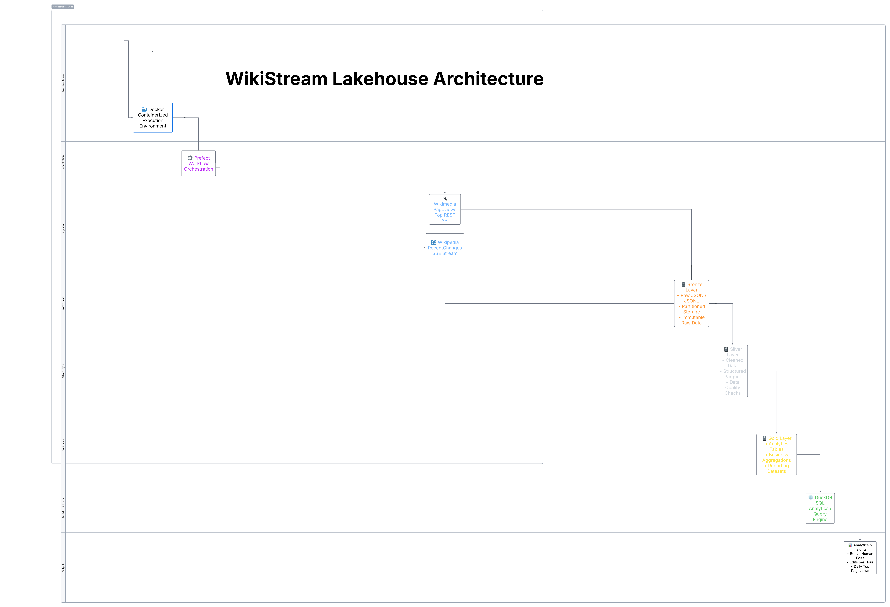
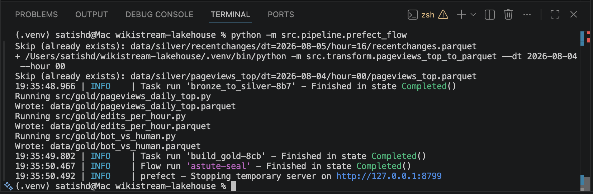
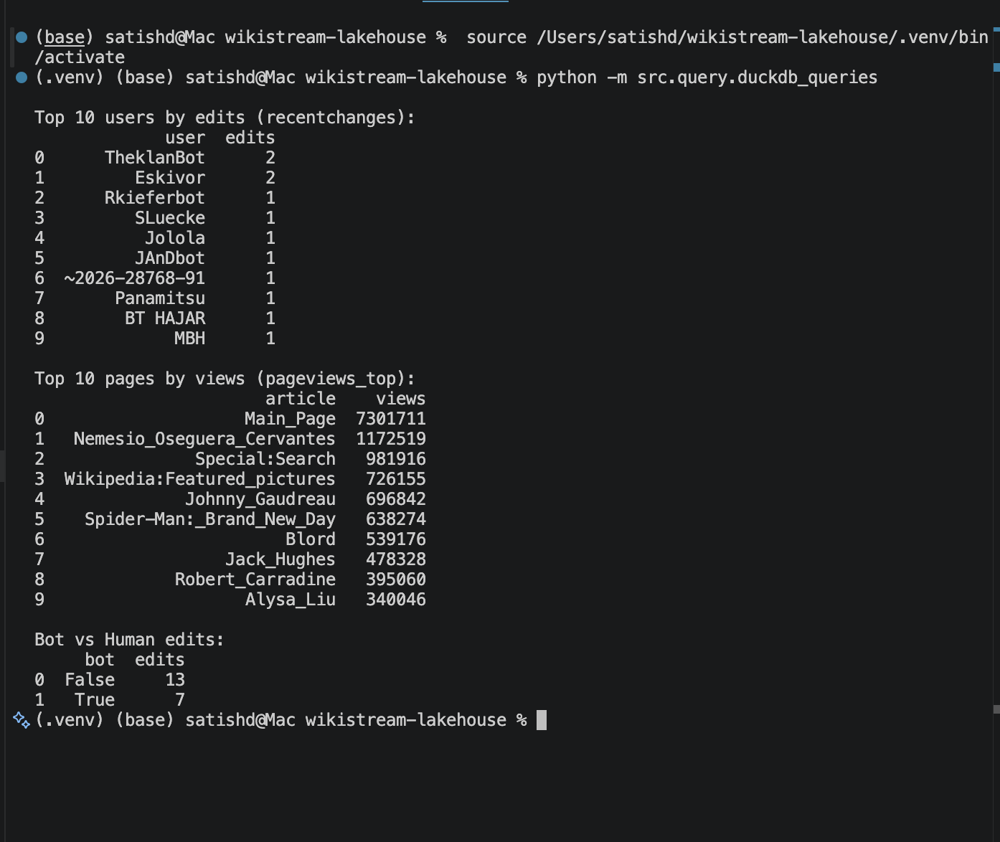

# WikiStream Lakehouse

WikiStream Lakehouse is an end-to-end data engineering project that ingests
real-time and batch data from Wikimedia and processes it through a
Bronze-Silver-Gold lakehouse architecture.

The project combines the Wikipedia RecentChanges Server-Sent Events stream
with the Wikimedia Pageviews Top REST API to demonstrate how streaming and
batch data can be ingested, transformed, validated, orchestrated, and prepared
for analytics.

The pipeline is developed in Python, orchestrated with Prefect, containerised
with Docker, stored using JSON, JSONL, and partitioned Parquet datasets, and
queried using DuckDB.

---

## Architecture



The project follows a layered lakehouse design:

- **Bronze:** Raw JSON and JSONL data retained for replay, auditing, and reprocessing
- **Silver:** Cleaned, standardised, and structured Parquet datasets
- **Gold:** Aggregated, analytics-ready datasets created using DuckDB

---

## Project Objectives

WikiStream Lakehouse demonstrates how to:

- Ingest real-time events from a Server-Sent Events stream
- Extract batch data from a REST API
- Preserve raw source data in a Bronze layer
- Clean and standardise records into Silver Parquet datasets
- Build analytics-ready Gold datasets
- Orchestrate dependent workflows using Prefect
- Support incremental and repeatable processing
- Partition datasets for efficient analytical queries
- Package the pipeline using Docker
- Query Parquet datasets using DuckDB

---

## Data Sources

### Wikipedia RecentChanges

The Wikipedia RecentChanges stream provides live information about Wikipedia
editing activity.

Example fields include:

- Page title
- User
- Timestamp
- Namespace
- Bot indicator
- Event type
- Revision details

The data is consumed through Wikimedia's Server-Sent Events endpoint.

### Wikimedia Pageviews Top API

The Wikimedia Pageviews Top REST API provides the most-viewed Wikipedia pages
for a selected project and date.

The pipeline retrieves daily pageview rankings and stores the raw API response
before transforming it into structured analytical datasets.

---

## Technology Stack

| Area | Technology |
|---|---|
| Programming language | Python |
| Workflow orchestration | Prefect |
| Data processing | Pandas, PyArrow |
| Analytical query engine | DuckDB |
| Storage formats | JSON, JSONL, Parquet |
| Streaming source | Wikimedia RecentChanges SSE |
| Batch source | Wikimedia Pageviews REST API |
| Containerisation | Docker |
| Architecture | Bronze-Silver-Gold lakehouse |

---

## Data Engineering Concepts Demonstrated

- Streaming data ingestion
- REST API integration
- Incremental processing
- Idempotent pipeline design
- Partitioned data storage
- Bronze-Silver-Gold architecture
- Columnar Parquet storage
- Workflow orchestration
- Data-quality validation
- Analytical data modelling
- Modular pipeline development
- Containerised execution

---

## Pipeline Flow

1. Prefect starts and coordinates the workflow.
2. RecentChanges events are collected from the Wikimedia SSE stream.
3. Pageview data is retrieved from the Wikimedia REST API.
4. Raw source records are written to the Bronze layer.
5. Bronze records are cleaned and standardised.
6. Structured datasets are written to the Silver layer as Parquet.
7. Data-quality checks are applied during transformation.
8. DuckDB queries Silver data and creates aggregated Gold datasets.
9. Gold datasets are made available for analytics and reporting.

---

## Lakehouse Layers

### Bronze Layer

The Bronze layer stores source data in its raw or near-original form.

Current Bronze formats include:

- JSONL for Wikipedia RecentChanges events
- JSON for Wikimedia Pageviews API responses

Bronze data is retained so that transformations can be rerun without retrieving
the same source data again.

The raw data can also support:

- Troubleshooting
- Auditing
- Historical replay
- Backfills
- Transformation testing

### Silver Layer

The Silver layer contains cleaned and structured data stored as Parquet.

Silver transformations include, where applicable:

- Schema standardisation
- Timestamp conversion
- Column selection
- Data-type conversion
- Null-value handling
- Duplicate handling
- Partitioned output generation

Parquet is used because it provides compressed columnar storage and efficient
analytical reads.

### Gold Layer

The Gold layer contains aggregated datasets designed for analytics and
reporting.

DuckDB is used to query Silver Parquet files and build the final analytical
outputs.

---

## Gold Datasets

The pipeline currently produces the following Gold datasets:

| Dataset | Description |
|---|---|
| `bot_vs_human.parquet` | Aggregates Wikipedia editing activity by bot and human contributor type |
| `edits_per_hour.parquet` | Aggregates RecentChanges events by hourly time window |
| `pageviews_daily_top.parquet` | Stores the highest-viewed Wikipedia pages for each processed date |

These datasets are designed to answer questions such as:

- What proportion of edits are made by bots?
- During which hours is editing activity highest?
- Which Wikipedia pages receive the most daily views?
- How does bot activity compare with human activity?

---

## Key Engineering Decisions

| Decision | Reason |
|---|---|
| Bronze-Silver-Gold architecture | Separates raw ingestion, cleaned data, and analytics-ready outputs |
| JSON and JSONL in Bronze | Preserves source records for replay, debugging, and auditing |
| Parquet in Silver and Gold | Provides compression, columnar storage, and efficient analytical reads |
| Prefect orchestration | Coordinates task dependencies, execution order, and workflow visibility |
| DuckDB analytics | Enables fast local analytical queries directly against Parquet files |
| Docker containerisation | Provides a reproducible and consistent execution environment |
| Partitioned storage | Reduces unnecessary scanning and supports date-based processing |
| Modular Python components | Separates ingestion, transformation, modelling, and query responsibilities |
| Deterministic output paths | Supports predictable reruns and repeatable pipeline execution |
| Separate processing layers | Allows raw data to be reprocessed when transformation logic changes |

---

## Incremental and Idempotent Processing

The pipeline is designed to support repeatable execution without unnecessarily
creating duplicate output files.

The implementation uses:

- Date-based input and output partitions
- Deterministic output locations
- Separate Bronze, Silver, and Gold processing stages
- Repeatable transformations from stored raw data
- Checks for existing files or partitions where implemented

This design allows Bronze data to be reprocessed when transformation logic is
updated.

It also supports controlled backfills for pageview data.

> Note: Update this section so that it describes the exact behaviour implemented
> in the code. Do not claim duplicate prevention or checkpointing unless the
> relevant checks are present.

---

## Data Quality

The transformation layer validates data before publishing structured outputs.

Current or planned validation checks include:

- Required-column validation
- Timestamp parsing
- Expected data-type validation
- Null checks on key fields
- Duplicate-record checks
- Non-empty output validation
- Source and output record-count comparisons where applicable

Invalid data should not be promoted from Bronze to Silver or from Silver to
Gold.

> Remove any validation item that is not currently implemented.

---

## Project Structure

```text
wikistream-lakehouse/
├── src/
│   ├── ingest/
│   │   ├── storage.py
│   │   ├── fetch_recentchanges.py
│   │   ├── fetch_recentchanges_api.py
│   │   ├── fetch_pageviews.py
│   │   └── backfill_pageviews.py
│   ├── transform/
│   │   ├── recentchanges_to_parquet.py
│   │   ├── pageviews_top_to_parquet.py
│   │   ├── bronze_to_silver.py
│   │   └── bronze_to_silver_latest.py
│   ├── gold/
│   │   ├── pageviews_daily_top.py
│   │   ├── edits_per_hour.py
│   │   ├── bot_vs_human.py
│   │   └── run_gold.py
│   └── query/
│       └── duckdb_queries.py
├── images/
│   └── WikiStream_Lakehouse_Architecture_diagram.png
├── data/
│   ├── bronze/
│   ├── silver/
│   └── gold/
├── data_samples/
├── Dockerfile
├── .dockerignore
├── requirements.txt
├── .gitignore
└── README.md
```

---

## Getting Started

### Prerequisites

- Python 3.10+
- Docker
- Git

### Clone the Repository

```bash
git clone https://github.com/YOUR_USERNAME/wikistream-lakehouse.git
cd wikistream-lakehouse
```

### Create a Virtual Environment

```bash
python -m venv .venv
```

### Activate the Environment

macOS/Linux:

```bash
source .venv/bin/activate
```

Windows:

```powershell
.venv\Scripts\Activate.ps1
```

### Install Dependencies

```bash
pip install -r requirements.txt
```

---

## Running the Pipeline

### 1. Ingest RecentChanges Data

```bash
python -m src.ingest.fetch_recentchanges \
  --limit 200 \
  --timeout-sec 30
```

### 2. Ingest Pageviews Data

```bash
python -m src.ingest.fetch_pageviews \
  --year 2026 \
  --month 1 \
  --day 15
```

### 3. Backfill Historical Pageviews

```bash
python -m src.ingest.backfill_pageviews \
  --start 2026-01-01 \
  --end 2026-01-07
```

### 4. Transform Bronze Data to Silver

```bash
python -m src.transform.bronze_to_silver
```

### 5. Build Gold Datasets

```bash
python -m src.gold.run_gold
```

### 6. Query Gold Data

```bash
python -m src.query.duckdb_queries
```

---


## Run with Docker

### Build the Docker image

```bash
docker build -t wikistream-lakehouse .
```

### Run the container

On macOS or Linux:

```bash
docker run --rm \
  -v "$(pwd)/data:/app/data" \
  wikistream-lakehouse
```

On Windows PowerShell:

```powershell
docker run --rm `
  -v "${PWD}/data:/app/data" `
  wikistream-lakehouse
```

The volume mount keeps generated Bronze, Silver, and Gold data available on
the host machine after the container stops.

> Confirm that `/app/data` matches the working directory configured in your
> Dockerfile.

---

## Pageviews Backfill

The project contains a pageviews backfill component for processing historical
dates.

Example command:

```bash
python -m src.ingest.backfill_pageviews
```

Document the accepted arguments if the script supports configurable dates.

Example:

```bash
python -m src.ingest.backfill_pageviews \
  --start-date 2026-01-01 \
  --end-date 2026-01-07
```

> Keep the example with date arguments only if your script actually supports
> those options.

---

## Querying the Data

DuckDB can query Parquet files directly without loading them into a separate
database server.

Example SQL:

```sql
SELECT
    edit_hour,
    COUNT(*) AS edit_count
FROM read_parquet('data/silver/recentchanges/**/*.parquet')
GROUP BY edit_hour
ORDER BY edit_hour;
```

Example Gold query:

```sql
SELECT *
FROM read_parquet('data/gold/edits_per_hour.parquet')
ORDER BY edit_count DESC;
```


---

## Example Outputs

### Bot versus Human Editing Activity

```text
contributor_type | edit_count
-----------------|-----------
human            | ...
bot              | ...
```

### Edits per Hour

```text
edit_hour | edit_count
----------|-----------
00        | ...
01        | ...
02        | ...
```

### Daily Top Pageviews

```text
date       | page_title       | views | rank
-----------|------------------|-------|-----
YYYY-MM-DD | Example article  | ...   | ...
```


---


### Prefect Flow Run

```markdown

```

### Generated Lakehouse Layers

```markdown

```

### DuckDB Query Results

```markdown

```

---

```bash
pytest -v
```

---

## Current Limitations

- The pipeline currently uses local filesystem storage.
- The project is designed as a portfolio implementation rather than a
  production-hosted platform.
- SSE ingestion runs for a defined collection period rather than as a fully
  managed continuous service.
- DuckDB is used for local analytics rather than distributed processing.
- Monitoring is currently limited to application and Prefect logs.
- The project does not currently include a hosted dashboard.
- The current implementation does not use cloud object storage.

---

## Future Improvements

Planned improvements include:

- Add unit and integration tests
- Add GitHub Actions for continuous integration
- Add structured logging
- Add additional Prefect retry policies
- Add configurable SSE checkpoints
- Add automated schema validation
- Add pipeline metrics and record-count reporting
- Add more detailed data-quality checks
- Store Bronze and Silver data in Amazon S3
- Use AWS Glue or PySpark for larger-scale transformations
- Query cloud datasets through Amazon Athena
- Add Apache Iceberg table support
- Create a Power BI dashboard from the Gold datasets
- Add monitoring and alerting for pipeline failures

---

## Cloud Deployment Design

The current project runs locally using Docker. A possible AWS deployment could
map the existing components as follows:

| Current component | Possible AWS service |
|---|---|
| Local Bronze storage | Amazon S3 Bronze prefix |
| Local Silver storage | Amazon S3 Silver prefix |
| Local Gold storage | Amazon S3 Gold prefix |
| Python ingestion | AWS Lambda, ECS, or scheduled container task |
| Prefect workflow | Prefect Cloud or Prefect worker on ECS |
| Pandas/PyArrow transformation | AWS Glue or ECS task |
| DuckDB analytics | Amazon Athena or DuckDB running in a container |
| Local logs | Amazon CloudWatch Logs |
| Docker image | Amazon Elastic Container Registry |

This section represents a possible future deployment architecture and is not
part of the current implementation.

---

## What I Learned

This project provided practical experience with:

- Designing layered data architectures
- Working with both streaming and batch sources
- Preserving raw data for replay and debugging
- Transforming semi-structured JSON into Parquet
- Partitioning analytical datasets
- Orchestrating dependent pipeline stages
- Building aggregated analytical models
- Querying Parquet directly with DuckDB
- Containerising a data pipeline
- Designing pipelines for repeatable execution

---

## Licence

Add the licence used by the repository.

Example:

```text
MIT License
```

See the `LICENSE` file for details.
